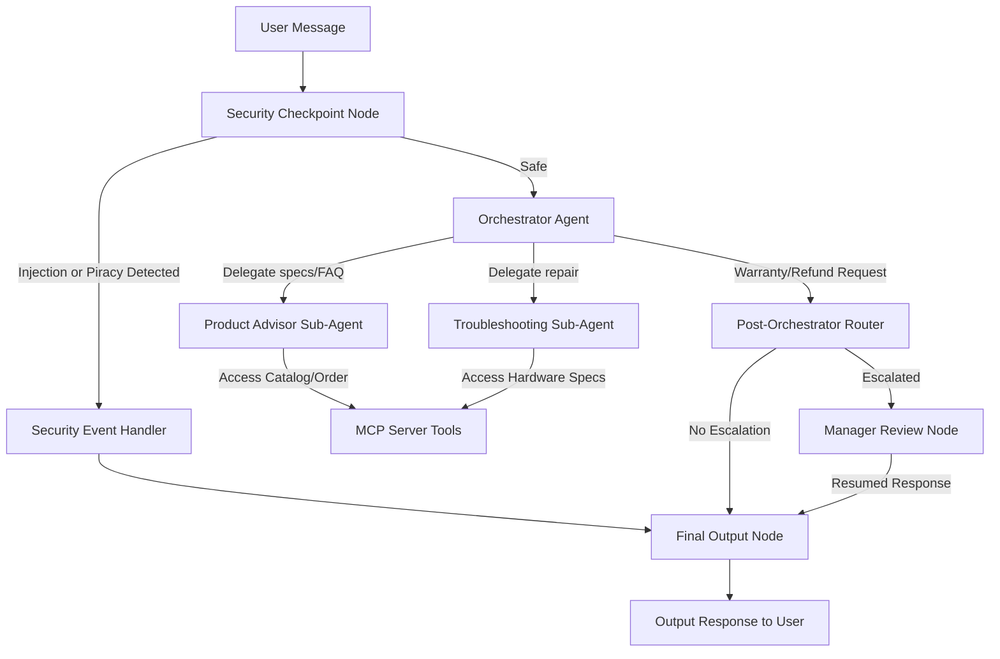
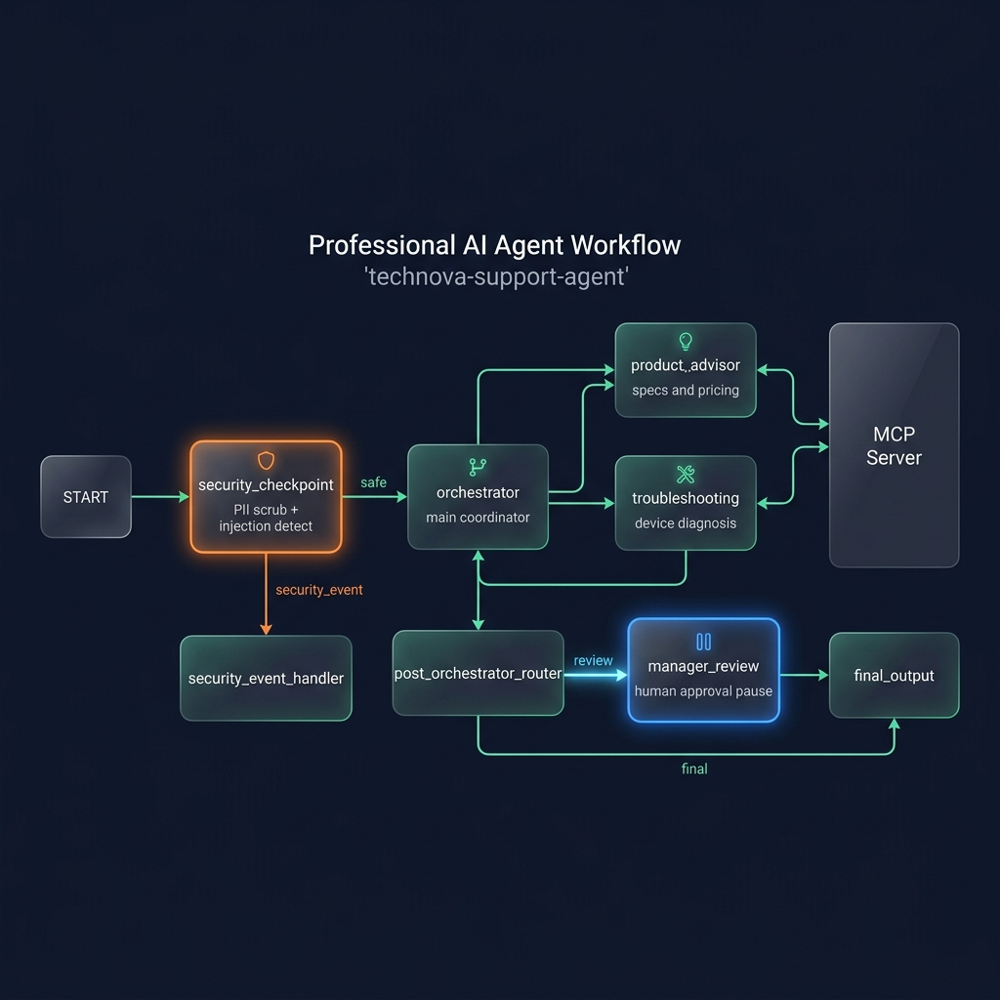

# TechNova AI Customer Support Agent

Friendly, secure, and multi-agent AI customer support assistant for TechNova Solutions computer hardware and peripherals.

## Prerequisites

* Python 3.11+
* [uv](https://docs.astral.sh/uv/getting-started/installation/) package manager
* Gemini API Key from [Google AI Studio](https://aistudio.google.com/apikey)

## Quick Start

```bash
git clone <repo-url>
cd technova-support-agent
cp .env.example .env   # add your GOOGLE_API_KEY
make install
make playground        # opens UI at http://localhost:18081
```

## Architecture Diagram



## How to Run

* **Interactive UI Test**:
  ```bash
  make playground
  ```
  This opens the local web-based playground at [http://localhost:18081](http://localhost:18081).
* **Local Web Server Mode**:
  ```bash
  make run
  ```

## Sample Test Cases

### Test Case 1: Product Specifications Query
* **Input**: `"What are the specs of the TechNova Book 15 laptop?"`
* **Expected**: The Orchestrator routes the query to the `product_advisor` agent, which calls the `get_product_details` tool on the MCP server.
* **Check**: You see the model return: `"TechNova Book 15 Laptop: Intel Core i7, 16GB RAM, 512GB SSD..."`

### Test Case 2: Troubleshooting Guidance
* **Input**: `"My mouse cursor is not moving."`
* **Expected**: The Orchestrator routes the query to the `troubleshooting` agent.
* **Check**: You receive step-by-step wireless mouse troubleshooting (checking USB dongle, battery, power switch) and are provided with the email `palaniket497@gmail.com` for unresolved issues.

### Test Case 3: Warranty Replacement (Manager Approval)
* **Input**: `"I want a warranty replacement for my Clarity Monitor."`
* **Expected**: The Orchestrator uses the `request_manager_review` tool, escalating the request. The workflow pauses and triggers the `manager_review` Human-in-the-Loop node.
* **Check**: The UI displays a prompt asking for manager approval. Replying `"approve"` returns: `"✅ Warranty request APPROVED by manager."`

## Troubleshooting

1. **`429 RESOURCE_EXHAUSTED` Error**:
   * *Cause*: Free tier quota limit exceeded for your Gemini API key.
   * *Solution*: Switch the model in your `.env` to `gemini-2.5-flash-lite`, which offers much higher daily limits on the free tier.
2. **Changes to code not showing up**:
   * *Cause*: On Windows, hot-reload is disabled because of the MCP server's asyncio subprocess loops.
   * *Solution*: Kill the server and restart it. In PowerShell run:
     `Get-Process -Id (Get-NetTCPConnection -LocalPort 18081, 8090 -ErrorAction SilentlyContinue).OwningProcess | Stop-Process -Force` then run `make playground`.
3. **`ValidationError` on Orchestrator**:
   * *Cause*: Mixing `output_schema` and `tools` on the same `LlmAgent`.
   * *Solution*: Remove `output_schema` and handle structural tasks or states via tools (like `request_manager_review`).

## Assets

* **Workflow Architecture Diagram**: [architecture_diagram.png](file:///c:/Users/ANIKET%20PAL/Downloads/AI_customer_support/technova-support-agent/assets/architecture_diagram.png)
* **Cover Banner**: [cover_page_banner.png](file:///c:/Users/ANIKET%20PAL/Downloads/AI_customer_support/technova-support-agent/assets/cover_page_banner.png)

## Demo Script

The spoken walkthrough narration for presenting this project can be found in [DEMO_SCRIPT.txt](file:///c:/Users/ANIKET%20PAL/Downloads/AI_customer_support/technova-support-agent/DEMO_SCRIPT.txt).

## Push to GitHub

1. Create a new repo at https://github.com/new
   - Name: technova-support-agent
   - Visibility: Public or Private
   - Do NOT initialize with README (you already have one)

2. In your terminal, navigate into your project folder:
   cd technova-support-agent
   git init
   git add .
   git commit -m "Initial commit: technova-support-agent ADK agent"
   git branch -M main
   git remote add origin https://github.com/<your-username>/technova-support-agent.git
   git push -u origin main

3. Verify .gitignore includes:
   .env          ← your API key — must NEVER be pushed
   .venv/
   __pycache__/
   *.pyc
   .adk/

⚠️ NEVER push .env to GitHub. Your API key will be exposed publicly.

## Assets

- **Workflow Diagram:** 
- **Cover Page Banner:** 

