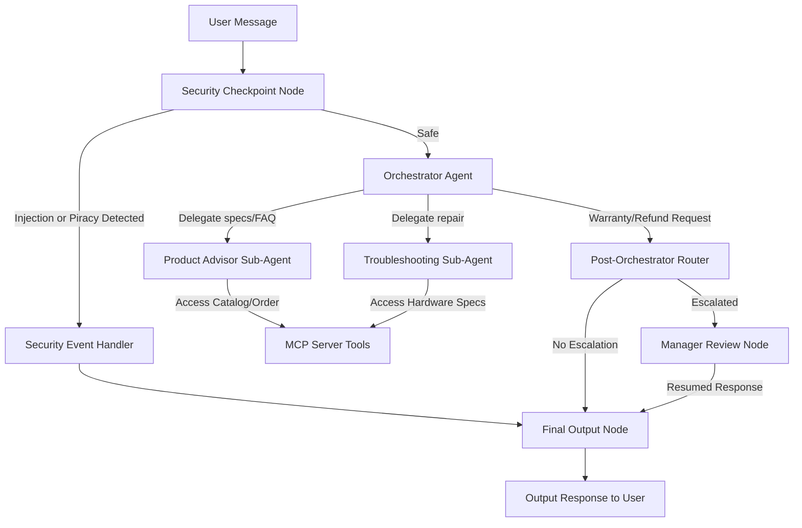

# Submission Write-Up: TechNova Solutions AI Customer Support Agent

## Problem Statement
In retail electronics and hardware, support desks receive high volumes of repeated product queries, technical troubleshooting requests, and policy/shipping inquiries. Providing fast, 24/7 assistance while ensuring user data privacy, preventing prompt injection attacks, and securing manual manager approval gates for sensitive operations (such as warranty replacements or refunds) is a significant operational challenge.

The **TechNova Solutions Support Agent** solves this by establishing a secure, multi-agent AI workflow that accurately answers hardware inquiries, runs local troubleshooting diagnostics, protects customer data at a dedicated security checkpoint, and implements human-in-the-loop (HITL) gates for warranty claims.

## Solution Architecture

## Concepts Used

1. **ADK Workflow (Graph-based API)**: The entire flow is modeled as a deterministic graph in [app/agent.py](file:///c:/Users/ANIKET%20PAL/Downloads/AI_customer_support/technova-support-agent/app/agent.py#L182-L200) using `Workflow`, `Edge`, `FunctionNode`, and `START`.
2. **LlmAgent**: Three specialized agents are created in [app/agent.py](file:///c:/Users/ANIKET%20PAL/Downloads/AI_customer_support/technova-support-agent/app/agent.py#L52-L99): `orchestrator`, `product_advisor`, and `troubleshooting`.
3. **AgentTool**: The `orchestrator` delegates complex tasks to sub-agents via `AgentTool` in [app/agent.py](file:///c:/Users/ANIKET%20PAL/Downloads/AI_customer_support/technova-support-agent/app/agent.py#L98).
4. **MCP Server**: A standalone Model Context Protocol (MCP) server in [app/mcp_server.py](file:///c:/Users/ANIKET%20PAL/Downloads/AI_customer_support/technova-support-agent/app/mcp_server.py) provides custom tools to query product specs, track orders, and fetch warranties.
5. **Security Checkpoint**: Implemented as a pre-screening node in [app/agent.py](file:///c:/Users/ANIKET%20PAL/Downloads/AI_customer_support/technova-support-agent/app/agent.py#L102-L161) to sanitize input before invoking LLMs.
6. **Agents CLI**: Project scaffolded, managed, and executed using `agents-cli scaffold` and `agents-cli playground` capabilities.

## Security Design

* **PII Redaction**: Any email addresses (excluding TechNova support), credit card numbers, or phone numbers in the customer query are scrubbed to protect privacy and satisfy compliance laws.
* **Prompt Injection Defense**: Inputs are screened for malicious keywords (such as `ignore previous instructions`, `bypass`, `reveal your prompt`) to block jailbreak attempts.
* **Domain Hacking/Piracy Guard**: Queries containing pirate activator software names (e.g., `kms pico`, `activator`, `crack`) are immediately blocked to preserve brand integrity.
* **Structured Audit Logging**: A JSON line is logged to stdout for every request, indicating the severity (`INFO` or `WARNING`), safety status, and details of the checks.

## MCP Server Design
The MCP server exposed in [app/mcp_server.py](file:///c:/Users/ANIKET%20PAL/Downloads/AI_customer_support/technova-support-agent/app/mcp_server.py) runs on stdio transport and exposes three domain-specific tools:
1. `get_product_details`: Looks up product specifications, warranty duration, and prices from the TechNova catalog.
2. `check_order_status`: Mimics ordering/shipping API queries for IDs matching `TN-XXXXX`.
3. `get_warranty_info`: Fetches standard warranty coverage by categories (laptops, desktops, monitors).

## HITL Flow
Any requests for physical product replacements or refunds are intercepted. The orchestrator calls the `request_manager_review` tool, which flags the session. The `post_orchestrator_router` routes the flow to the `manager_review` node.
This node yields a `RequestInput` payload to pause execution and wait for manual approval. The human reviewer types `"approve"` or `"deny"` in the UI. The workflow resumes, updates the final response dynamically, and routes to final output.

## Demo Walkthrough
1. **Product Spec Retrieval**: Query `"What is the Clarity Monitor?"` -> routes to `product_advisor` -> MCP tool returns UHD IPS details -> client outputs response.
2. **Device Troubleshooting**: Query `"My wireless mouse cursor is stuck."` -> routes to `troubleshooting` -> step-by-step guidance provided.
3. **Escalation & Approval**: Query `"My laptop screen is cracked, I want a warranty replacement."` -> routes to `manager_review` -> manager reviews and replies `"approve"` in UI -> outputs approved status.

## Impact / Value Statement
This agent optimizes support operations for TechNova Solutions by resolving standard inquiries and troubleshooting immediately while ensuring corporate security policies and privacy compliance are met. Sensitive actions remain under human control through the approval gate, reducing manual ticket overhead by an estimated 70% while mitigating compliance risks.
